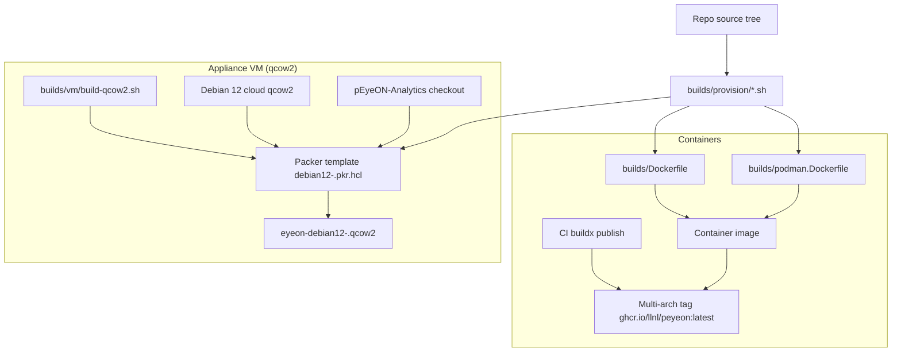
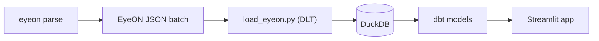

# BUILD.md

Build and packaging instructions for pEyeON containers and appliance VM images, including cross-architecture notes.

## Quick Links

- Container Dockerfile: `builds/Dockerfile`
- Container Podman Dockerfile: `builds/podman.Dockerfile`
- Shared provisioning scripts (containers + VM): `builds/provision/`
- VM qcow2 build wrapper: `builds/vm/build-qcow2.sh`
- VM Packer templates: `builds/vm/packer/debian12-*.pkr.hcl`

## Build Dependency Diagram

The build system has two primary delivery paths (containers and qcow2 VM images). Both reuse the same provisioning scripts.





## Build Matrix (Common Permutations)

| Artifact                  | Host example   | Target arch | Build tooling       | Command                                                | Notes                                                                |
| ------------------------- | -------------- | ----------- | ------------------- | ------------------------------------------------------ | -------------------------------------------------------------------- |
| Published container image | Any            | amd64/arm64 | Docker              | `docker pull ghcr.io/llnl/peyeon:latest`               | Multi-arch tag; Docker selects the right arch automatically.         |
| Local Docker container    | Linux amd64    | host arch   | Docker              | `docker build -f builds/Dockerfile -t peyeon .`        | Single-arch local build.                                             |
| Local Docker container    | macOS arm64    | host arch   | Docker Desktop      | `docker build -f builds/Dockerfile -t peyeon .`        | Single-arch local build.                                             |
| Local Podman container    | Linux          | host arch   | Podman              | `podman build -f builds/podman.Dockerfile -t peyeon .` | Single-arch local build.                                             |
| CI multi-arch container   | GitHub Actions | amd64+arm64 | buildx              | (see workflow)                                         | Implemented in `.github/workflows/publish-multiarch-container.yaml`. |
| Debian 12 qcow2 appliance | macOS arm64    | arm64       | Packer + QEMU (HVF) | `bash builds/vm/build-qcow2.sh --arm64`                | Fastest path on Apple Silicon.                                       |
| Debian 12 qcow2 appliance | macOS arm64    | amd64       | Packer + QEMU (TCG) | `bash builds/vm/build-qcow2.sh --amd64`                | Emulated and slow.                                                   |
| Debian 12 qcow2 appliance | Linux amd64    | amd64       | Packer + QEMU/KVM   | `bash builds/vm/build-qcow2.sh --amd64`                | Use KVM acceleration when available.                                 |

## Containers

### Using the Published Multi-Arch Image

The primary image is published as a multi-arch tag:

```bash
docker pull ghcr.io/llnl/peyeon:latest
docker run --rm ghcr.io/llnl/peyeon:latest eyeon --help
```

Development tags:

```bash
docker pull ghcr.io/llnl/peyeon:dev-<branch>
docker pull ghcr.io/llnl/peyeon:dev-<sha>
```

### Local Docker Build (Single-Arch)

```bash
docker build -f builds/Dockerfile -t peyeon .
docker run --rm -it -v "$(pwd):/workdir:Z" peyeon /bin/bash
```

### Local Podman Build (Single-Arch)

```bash
podman build -f builds/podman.Dockerfile -t peyeon .
podman run --rm -it -v "$(pwd):/workdir:rw" peyeon /bin/bash
```

### Multi-Arch / Cross-Platform Container Builds

The repository CI builds `linux/amd64` and `linux/arm64` images using Docker buildx.

- Build/test workflow: `.github/workflows/test-build-container.yaml`
- Publish workflow: `.github/workflows/publish-multiarch-container.yaml`

If you need to run buildx locally:

```bash
# Example: build and load a single target platform locally
docker buildx build -f builds/Dockerfile --platform linux/arm64 --load -t peyeon:local-arm64 .
```

Known limitation on Apple Silicon:

- Building `linux/amd64` under emulation can fail when the image build runs Rust toolchains (notably when building Binwalk v3) due to QEMU user-mode instability. If you hit `qemu: uncaught target signal 11 (Segmentation fault)`, prefer running the amd64 build on a native amd64 machine or rely on CI.

## VM Images (qcow2 appliance)

The qcow2 appliance build starts from the Debian 12 cloud image and provisions it via Packer.

### Prerequisites (macOS)

```bash
brew install qemu
brew install hashicorp/tap/packer
python3 -m pip install --user build
```

### Prerequisites (RHEL 8/9)

Install QEMU/KVM + Packer + Python build tooling:

```bash
sudo dnf install -y qemu-kvm qemu-img

sudo dnf install -y dnf-plugins-core
sudo dnf config-manager --add-repo https://rpm.releases.hashicorp.com/RHEL/hashicorp.repo
sudo dnf install -y packer

sudo dnf install -y python3-pip
python3 -m pip install --user build
```

### Build

```bash
# Defaults to host architecture (arm64 on Apple Silicon, amd64 on Intel)
bash builds/vm/build-qcow2.sh

bash builds/vm/build-qcow2.sh --arm64
bash builds/vm/build-qcow2.sh --amd64
```

Outputs are written to:

- `builds/vm/output/debian12-arm64/eyeon-debian12-arm64.qcow2`
- `builds/vm/output/debian12-amd64/eyeon-debian12-amd64.qcow2`

Notes:

- On Apple Silicon, `--amd64` builds run under QEMU TCG emulation and are much slower.
- The amd64 Packer template sets a QEMU CPU model to avoid SIGILL in common Python wheels under emulation.

### Operating / Running (libvirt)

Get the IP address (works on RHEL for the default libvirt NAT network; does not require the guest agent):

```bash
mac="$(virsh domiflist eyeon-debian12-amd64 | awk '/network/ {print $5; exit}')" \
  && virsh net-dhcp-leases default | awk -v mac="$mac" 'tolower($0) ~ tolower(mac) {print $5}' | cut -d/ -f1
```

Cleanup and recreate a domain using the same qcow2 path:

```bash
virsh shutdown eyeon-debian12-amd64 || true
virsh destroy eyeon-debian12-amd64 || true

# Remove the domain definition (this is what clears "Disk ... already in use")
virsh undefine eyeon-debian12-amd64 --nvram || virsh undefine eyeon-debian12-amd64

virsh list --all
```

## Troubleshooting (common operator tasks)

### virsh console detach

Detach from `virsh console` back to the `virsh` prompt:

`Ctrl + ]`

### Shutdown a libvirt domain

```bash
virsh shutdown <domain>
virsh domstate <domain>

# If graceful shutdown fails:
virsh destroy <domain>
```

### SSH "Too many authentication failures"

Force password auth and ignore keys:

```bash
ssh -o PreferredAuthentications=password -o PubkeyAuthentication=no eyeon@<IP>
```

### Guest networking fallback (inside the VM)

If a VM boots without bringing the NIC up, you can usually recover manually:

```bash
sudo ip link set <iface> up
sudo dhclient -v <iface>
```

The Debian qcow2 appliance provisioning configures systemd-networkd DHCP to avoid needing this in normal cases.

### libguestfs tooling (RHEL)

On RHEL-like hosts, the package you want is typically `libguestfs-tools` (not `guestfs-tools`).

## Glossary (Builder-Focused)

This is a short glossary for the build and packaging surface area. A longer, builder-first glossary (with more background and repo pointers) lives in the companion wiki.

### Build + Packaging

Docker: Container runtime and build tool used for local builds and CI.
More info: https://docs.docker.com/

Podman: OCI container runtime used for rootless/container workflows on some Linux hosts.
More info: https://podman.io/

OCI image: The container artifact format used by Docker/Podman and published to GHCR.
More info: https://opencontainers.org/

buildx (multi-arch): Docker plugin used to build and publish multi-arch images (`linux/amd64`, `linux/arm64`).
More info: https://docs.docker.com/build/building/multi-platform/
Gotcha: On Apple Silicon, `docker buildx build --platform linux/amd64 ...` may fail during Rust toolchains (Binwalk build) under QEMU user-mode emulation. Prefer CI or a native amd64 builder.

Packer: Image builder used to provision Debian cloud images into qcow2 appliance artifacts.
More info: https://developer.hashicorp.com/packer

QEMU: Virtual machine emulator used by Packer for qcow2 builds (HVF acceleration for arm64 guests on Apple Silicon; TCG emulation for amd64-on-arm64).
More info: https://www.qemu.org/
Gotcha: amd64-on-Apple-Silicon runs under TCG and is slow; CPU model selection can matter for Python wheels.

qcow2: Disk image format used for KVM/Nutanix AHV.
More info: https://wiki.qemu.org/Documentation/Storage

cloud-init: First-boot provisioning mechanism used by Debian cloud images and the Packer qcow2 build.
More info: https://cloudinit.readthedocs.io/

libvirt / virsh: VM management stack commonly used on Linux hosts.
More info: https://libvirt.org/manpages/virsh.html

### Provisioning Contract

Provision scripts (`builds/provision/*.sh`): Shared, idempotent installation scripts used by both container and VM build paths.

apt (Debian packages): System package manager used by provisioning scripts for native dependencies.

uv: Python tool used to install Python versions and synchronize dependency locks (used by the appliance VM to install analytics).
More info: https://docs.astral.sh/uv/
Pin guidance: If an image build breaks due to upstream changes, pin `uv` and/or Python minor versions in provisioning.

### Native Tools (Installed in Images)

Binwalk v3: Firmware/container analysis and extraction tool compiled during builds.
More info: https://github.com/ReFirmLabs/binwalk
Gotcha: Builds involve Rust; see buildx emulation note above.

sasquatch: SquashFS extractor used by Binwalk v3.
More info: https://github.com/onekey-sec/sasquatch

TLSH: Fuzzy hashing library built from source in the image build.
More info: https://github.com/trendmicro/tlsh

DuckDB CLI: `duckdb` command-line tool installed for on-box DB inspection.
More info: https://duckdb.org/docs/api/cli/overview
Pin guidance: Defaults to DuckDB “latest”; set `DUCKDB_CLI_VERSION` to pin when needed.

### Analytics Pipeline (In the Appliance VM)

DLT: Python data loading framework used by `load_eyeon.py`.
More info: https://dlthub.com/
Gotcha: Pipeline state is persisted under `~/.dlt/` per user; first-run behavior differs from warmed dev machines.

dbt: SQL modeling/build tool used to transform silver to gold models.
More info: https://docs.getdbt.com/

Streamlit: App framework used for the exploration UI.
More info: https://docs.streamlit.io/
